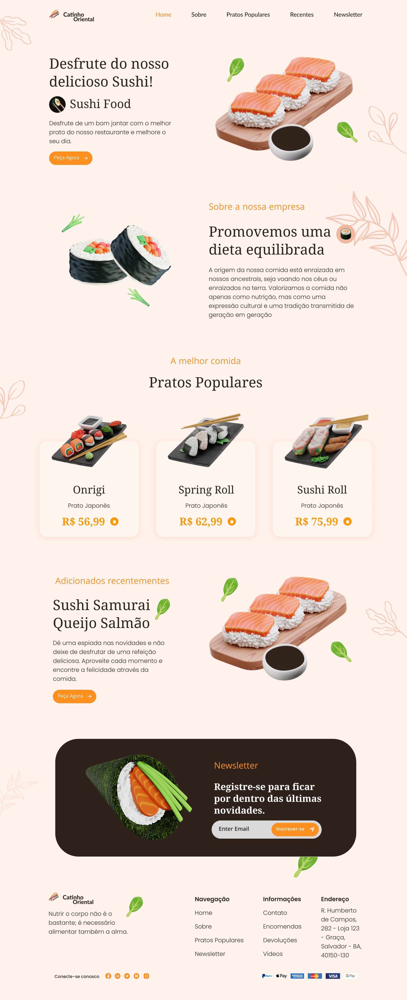

  Projeto Fictício
  

    
  

<h1 align="center">
  
</h1>

<ul style="padding: 0; list-style: none; display: flex; flex-direction: row; gap: 1rem; justify-content: center; align-items: center;">
  <li>
    <a href="#uma-breve-descrição">Uma breve descrição</a>
  </li>

  <li>
    <a href="#imagens">Imagens</a>
  </li>

  <li>
    <a href="#tecnologias-envolvidas">Tecnologias Envolvidas</a>
  </li>

  <li>
    <a href="#desenvolvedor">Desenvolvedor</a>
  </li>
</ul>

## Uma Breve Descrição

O **Cantinho Oriental**, uma empresa brasileira de culinária japnesa, tem o seu marco inicial em **03 de Setembro de 1987** , na cidade de Salvador, Bahia. No ano de 1989, o Cantinho Oriental já ocupava 5 bairros de Salvador, e sendo conhecida de forma exponencial. Hoje, no ano de 2024, o **Cantinho Oriental** conquistou o Brasil e o mundo com o seu longo cardápio, tendo presença em 13 estados e 4 países. O seu fundador e atual CEO, Enzo Evangelista, tem o prazer enorme de ser o principal responsável pela grande expansão do seu negócio.

## Tecnologias Envolvidas

Inicialmente, o projeto será desenvolvido utilizando o trio web: **_HTML, CSS e JavaScript_**. No futuro, planejo expandi-lo utilizando o **_ReactJS_**.

  <strong>Enzo Evangelista</strong>

