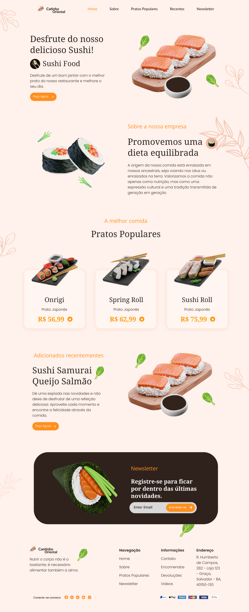

  

<h1 align="center">
  
</h1>

- [Uma breve descrição](#uma-breve-descrição).
- [Tecnologias envolvidas](#tecnologias-envolvidas).

## Uma Breve Descrição

O **Cantinho Oriental**, uma empresa brasileira de culinária japnesa, tem o seu marco inicial em **03 de setembro de 1987** , na cidade de Salvador, Bahia. No ano de 1989, o Cantinho Oriental já ocupava 5 bairros de Salvador, e sendo conhecida de forma exponencial. Hoje, no ano de 2024, o **Cantinho Oriental** conquistou o Brasil e o mundo com o seu longo cardápio. Tendo presença em 13 estados e 4 países, o seu fundador e atual CEO, Enzo Evangelista, tem o prazer enorme de ser o principal responsável pela grande expansão do seu negócio.

## Tecnologias Envolvidas

Inicialmente, o projeto será desenvolvido utilizando o trio web: **_HTML, CSS e JavaScript_**. No futuro, planejo expandi-lo utilizando o **_ReactJS_**.
